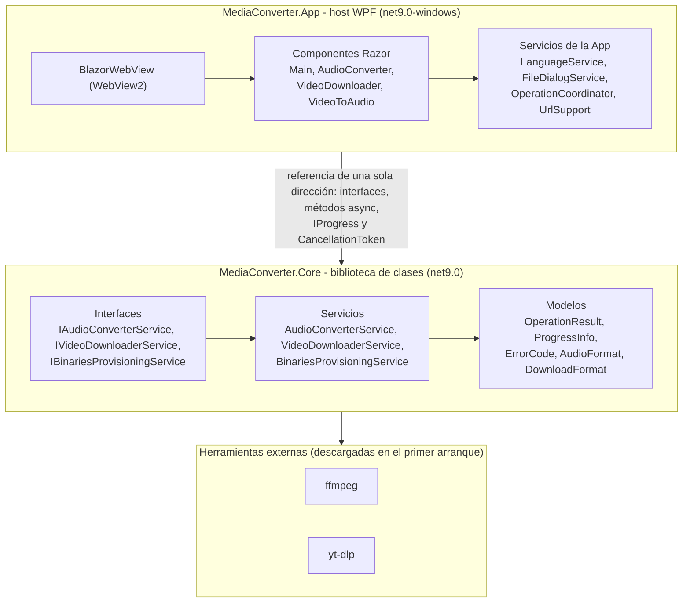

# MediaConverter

**[English](README.md) | [Español](README.es.md)**

<p align="center">
  
</p>

Conversor de medios de escritorio para Windows, construido con WPF y una UI híbrida de Blazor. Es una
herramienta ligera y totalmente bilingüe (español/inglés) para tres tareas cotidianas:

- Convertir archivos de audio entre M4A y MP3.
- Descargar medios desde una URL como MP4, MP3 o M4A.
- Extraer el audio en MP3 o M4A de un archivo MP4 local.

Por dentro demuestra una separación de responsabilidades limpia, una capa de lógica de negocio
testeable, reporte asíncrono de progreso, cancelación y una UI de escritorio híbrida que reutiliza
habilidades web en lugar de un motor de navegador empaquetado.

**Descarga:** bajá `MediaConverter-v0.1.0-win-x64.zip` desde la página de
[Releases](https://github.com/herrera-21/media-converter/releases/latest), descomprimilo y ejecutá
`MediaConverter.exe`. Es un único archivo autocontenido: sin runtime de .NET, sin instalador y sin
motor de navegador empaquetado. Es posible que Windows SmartScreen avise sobre un editor
desconocido porque el binario no está firmado; elegí "Más información" y luego "Ejecutar de todas
formas". En el primer arranque pregunta el idioma y descarga ffmpeg y yt-dlp, así que necesita
internet una vez.

SHA256 (`MediaConverter-v0.1.0-win-x64.zip`):
`5516F5AE13ACD521FA421257D322D736CDA9B724FC6D0F0A0694515ADE1CA5ED`

## Capturas

| Convertir audio | Descargar desde una URL | Extraer el audio de un video |
| --- | --- | --- |
|  |  |  |

### Convertir audio

Elige un archivo M4A o MP3 local con un diálogo nativo de Windows. Se muestra el formato detectado y
el formato de destino es por defecto el opuesto, así que el caso común no requiere ningún clic extra.
La ruta de salida se deriva junto al archivo de origen y se añade un sufijo numérico cuando el
archivo ya existe, de modo que nunca se sobrescribe un archivo existente. ffmpeg reporta el progreso
real de la transcodificación y la operación puede cancelarse en cualquier momento.

### Descargar desde una URL

Pega un enlace de video, elige MP4, MP3 o M4A y selecciona una carpeta de destino. El enlace se
valida como una URL `http`/`https` bien formada antes de que empiece la descarga, así que un enlace
mal formado mantiene el botón deshabilitado y se resalta cuando el campo pierde el foco. La descarga
reporta progreso real con yt-dlp y, al cancelar, se elimina cada archivo parcial.

### Extraer el audio de un video

Elige un archivo MP4 local, elige el formato de salida (MP3 o M4A) y la app crea el audio junto a
él, reutilizando la misma regla de nombres que no sobrescribe que la pestaña de audio. Una selección
que no sea MP4 se rechaza con un mensaje localizado.

## Arquitectura



La solución se divide en dos proyectos de código y dos proyectos de tests con una dirección de
dependencia estricta de una sola vía:

| Proyecto | Target | Propósito |
| --- | --- | --- |
| `src/MediaConverter.Core` | `net9.0` | Solo lógica de negocio. Posee los contratos de servicio y los modelos. Nunca referencia WPF, Blazor ni ningún tipo de UI. |
| `src/MediaConverter.App` | `net9.0-windows` | Host WPF que embebe un `BlazorWebView`. Depende de Core. |
| `tests/MediaConverter.Core.Tests` | `net9.0` | Tests xUnit para Core. |
| `tests/MediaConverter.App.Tests` | `net9.0-windows` | Tests xUnit para los helpers de la App y el contrato de localización. |

Dirección de dependencias: `App -> Core` y `Tests -> Core`. Core no depende de nada.

### UI

La UI se construye con componentes Razor renderizados dentro de un `BlazorWebView` de WPF. Se arma un
único `ServiceCollection` al arrancar y se entrega al WebView, de modo que los componentes Razor
reciben los servicios de Core mediante `@inject` estilo constructor, en lugar de una capa clásica de
view-models MVVM. WebView2 viene con Windows, así que la app no empaqueta ningún motor de navegador.

Los assets estáticos de `wwwroot` están embebidos en el ensamblado y los sirve
`EmbeddedBlazorWebView`, una subclase chica de `BlazorWebView` que sobrescribe `CreateFileProvider`.
Sin eso, la página host tendría que estar en una carpeta `wwwroot` junto al ejecutable y la app no
podría ser un solo archivo.

### Manejo de errores

Core nunca devuelve textos orientados al usuario. Cada operación devuelve un `OperationResult` que
lleva un `ErrorCode` legible por máquina cuando falla. La capa App mapea cada código a un texto en el
idioma activo, lo que mantiene a Core libre de preocupaciones de localización. Las operaciones largas
reportan el progreso mediante `IProgress<ProgressInfo>` y aceptan un `CancellationToken` para la
cancelación.

### Diagramas detallados

El conjunto completo vive en [`docs/diagrams`](docs/diagrams), en inglés y español:

- [Arquitectura](docs/diagrams/architecture.es.md): capas, componentes, la dependencia de una sola
  vía y el diagrama de clases de Core (interfaces, modelos, servicios y los parsers).
- [Conversión de audio](docs/diagrams/audio-conversion.es.md): secuencias de conversión, incluida la
  cancelación y la extracción de video a audio que reutiliza el mismo pipeline.
- [Descarga de video](docs/diagrams/video-download.es.md): secuencia de descarga con el directorio
  de trabajo aislado.
- [Aprovisionamiento de binarios](docs/diagrams/binaries-provisioning.es.md): descarga en el primer
  arranque de ffmpeg y yt-dlp.
- [Estados de operación de la UI](docs/diagrams/ui-operation-states.es.md): el ciclo de vida de las
  pestañas y la protección de reentrada.

## Decisiones técnicas

| Decisión | Elección | Por qué |
| --- | --- | --- |
| Plataforma de UI | WPF + Blazor Hybrid (`BlazorWebView`) | Reutiliza habilidades full-stack (HTML/CSS/Razor) sin diseñador visual, y es más ligero que Electron porque usa el runtime WebView2 ya presente en Windows. |
| Separación de la lógica de negocio | Una biblioteca de clases Core aparte | Testeable y reutilizable, y mantiene la UI reemplazable. Demuestra separación de responsabilidades. |
| Patrón de UI | Componentes Razor con servicios inyectados (DI), no MVVM clásico | MVVM con `ICommand` y bindings bidireccionales es nativo de WPF + XAML, no de Blazor. En Blazor el patrón natural es estado de componente más servicios. |
| Progreso y estado | Async de punta a punta con `IProgress<ProgressInfo>` y `CancellationToken` | La barra de progreso refleja el estado real del backend (no un spinner decorativo) y las operaciones largas pueden cancelarse. |
| Binarios externos | ffmpeg y yt-dlp invocados mediante `Process`, sin paquetes NuGet envoltorio | Control total sobre los argumentos y el parseo de la salida, y la cancelación mata el árbol de procesos hijo. Los binarios se descargan automáticamente en el primer arranque en la carpeta de datos local del usuario (`%LOCALAPPDATA%\MediaConverter`), así que no se escribe nada junto al ejecutable. |
| Nombres de salida | Derivados junto al origen, con un sufijo numérico cuando el nombre ya está tomado | Una conversión nunca sobrescribe un archivo existente y el usuario no recibe diálogos sorpresa. |
| Idiomas | ES + EN mediante recursos `.resx` e `IStringLocalizer` | El mecanismo nativo de .NET, funcionando igual en los componentes Razor y en el shell WPF. |
| Preferencia de idioma | Detectada del sistema, confirmada en el primer arranque y persistida en `settings.json` en la carpeta de datos de la aplicación | La entrega es un único ejecutable, así que "instalar" equivale al primer arranque; el usuario puede cambiar de idioma en cualquier momento y la preferencia sobrevive a las actualizaciones. |
| Distribución | Un único ejecutable autocontenido (`PublishSingleFile` + `SelfContained`, con los assets estáticos embebidos en el ensamblado) | El usuario final no instala nada: ni runtime de .NET, ni ffmpeg, ni asistente de instalación, y un solo archivo para ejecutar. |

## Estructura del proyecto

```text
MediaConverter/
├── src/
│   ├── MediaConverter.Core/            # net9.0, sin referencias de UI
│   │   ├── Interfaces/                 # IAudioConverterService, IVideoDownloaderService,
│   │   │                               # IBinariesProvisioningService
│   │   ├── Models/                     # OperationResult, ProgressInfo, ErrorCode,
│   │   │                               # AudioFormat, DownloadFormat, ProgressStage
│   │   └── Services/                   # AudioConverterService, VideoDownloaderService,
│   │                                   # BinariesProvisioningService y los parsers de ffmpeg/yt-dlp
│   └── MediaConverter.App/             # host WPF net9.0-windows
│       ├── Components/                 # Main, AudioConverter, VideoDownloader, VideoToAudio
│       ├── Controls/                   # EmbeddedBlazorWebView (sirve los assets estáticos embebidos)
│       ├── Localization/               # Código de error/etapa a texto localizado
│       ├── Resources/                  # Resources.resx (inglés) + Resources.es.resx (español)
│       ├── Services/                   # LanguageService, FileDialogService, OperationCoordinator,
│       │                               # UrlSupport, AudioFileSupport, VideoFileSupport
│       └── wwwroot/                    # index.html, app.css, fileDialog.js
├── tests/
│   ├── MediaConverter.Core.Tests/      # 121 tests xUnit para Core
│   └── MediaConverter.App.Tests/       # 46 tests xUnit para la capa App
├── docs/
│   ├── diagrams/                       # Diagramas Mermaid (arquitectura, secuencias, estados)
│   └── images/                         # Capturas y el GIF de demo que usa este README
└── MediaConverter.sln
```

## Requisitos

- Windows 10 o posterior (runtime WebView2, normalmente ya instalado).
- [SDK de .NET 9](https://dotnet.microsoft.com/download/dotnet/9.0) para compilar y ejecutar desde el
  código fuente.
- Conexión a internet en el primer arranque, para poder descargar los binarios externos.

## Compilar, testear y ejecutar

```sh
dotnet build
dotnet test
dotnet run --project src/MediaConverter.App
```

## Testing

La solución incluye dos suites de tests:

- `MediaConverter.Core.Tests` (121 tests): servicios de conversión, descarga y aprovisionamiento, los
  parsers de salida de ffmpeg/yt-dlp, clasificación de errores, rutas de binarios y comparación de
  versiones.
- `MediaConverter.App.Tests` (46 tests): el contrato de localización (cada `ErrorCode` y
  `ProgressStage` renderiza un mensaje amigable y no vacío en inglés y español, con paridad exacta de
  claves entre `Resources.resx` y `Resources.es.resx`), más las validaciones de URL/formato, los
  nombres de salida que no sobrescriben y la protección de reentrada del `OperationCoordinator`.

Ejecuta un test individual con `dotnet test --filter "FullyQualifiedName~MethodName"`.

## Binarios externos (ffmpeg y yt-dlp)

Las funciones de conversión y descarga dependen de dos herramientas externas de línea de comandos:

- **ffmpeg** convierte, transcodifica y remuxea audio y video. Realiza las conversiones M4A <-> MP3,
  extrae la pista de audio (MP3 o M4A) de un archivo MP4 local y maneja la extracción y el muxing que
  yt-dlp le delega.
- **yt-dlp** es un descargador de video/audio de línea de comandos (un fork de youtube-dl). Resuelve
  la URL solicitada y descarga el mejor stream disponible para el formato de salida elegido.

Ninguno de los dos binarios se empaqueta en este repositorio. Se descargan automáticamente en el
primer arranque en la carpeta de datos local del usuario (`%LOCALAPPDATA%\MediaConverter`, junto a
`settings.json`), así que la carpeta que contiene el ejecutable queda limpia, y se mantienen
actualizados por sí solos en arranques posteriores. Ambos se invocan directamente como procesos
externos (`Process`) con su salida parseada para obtener progreso real; no se usan paquetes NuGet
envoltorio.

## Estado

El MVP, el pulido de UX y la documentación del proyecto están completos, y la **v0.1.0 está
publicada** como un único ejecutable autocontenido para Windows. Bajalo desde la página de
[Releases](https://github.com/herrera-21/media-converter/releases/latest) y ejecutalo: no hay
runtime de .NET que instalar ni asistente de instalación.

- Las tres pestañas funcionan de punta a punta: conversión de audio, descarga desde URL y extracción
  de video a audio.
- Las validaciones, los estados vacíos y los estados de éxito, cancelación y error son consistentes
  en las tres pestañas. Cada error se renderiza como un mensaje localizado amigable, nunca como un
  código crudo.
- Cancelar una operación es un resultado neutro, limpia la barra de progreso y vuelve a habilitar
  todos los controles. Un `OperationCoordinator` marca una ejecución como en curso antes del primer
  `await`, así que un segundo clic no puede iniciar una operación en paralelo.
- Cada texto orientado al usuario vive en `Resources.resx` (inglés, por defecto) y
  `Resources.es.resx` (español) y se resuelve mediante `IStringLocalizer`, con paridad exacta de
  claves forzada por los tests.
- Los selectores nativos de archivos y carpetas corren en el host WPF y se alcanzan desde Razor
  mediante interoperabilidad de JavaScript.

## Uso y derechos de autor

MediaConverter está pensado para contenido que posees o estás autorizado a descargar. El caso de uso
original es recopilar videos que una comunidad escolar sube a su propio canal de YouTube. No lo uses
para descargar contenido de terceros sin permiso.
