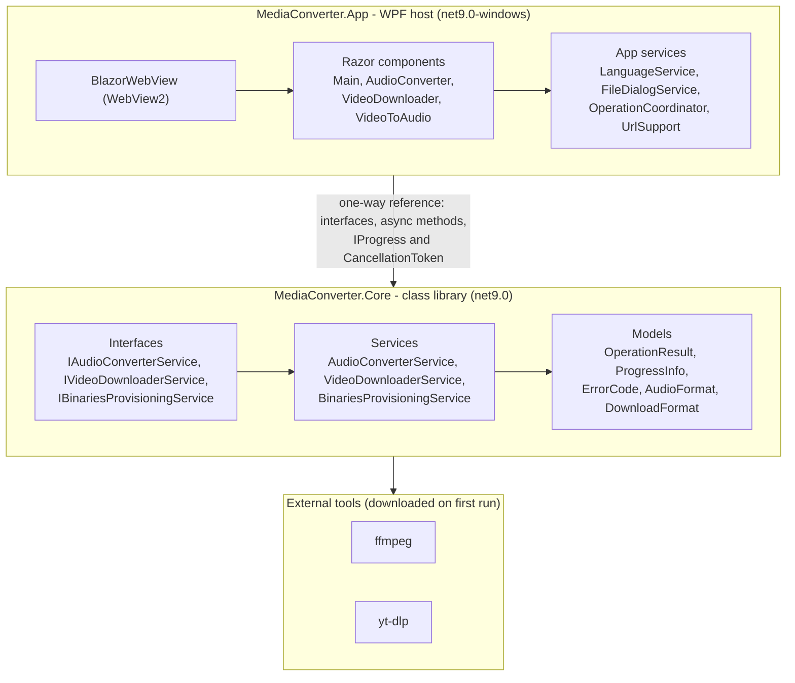

# MediaConverter

**[English](README.md) | [Español](README.es.md)**

<p align="center">
  
</p>

Windows desktop media converter built with WPF and a Blazor hybrid UI. It is a lightweight, fully
bilingual (Spanish/English) tool for three everyday tasks:

- Convert audio files between M4A and MP3.
- Download media from a URL as MP4, MP3 or M4A.
- Extract MP3 or M4A audio from a local MP4 file.

Under the hood it demonstrates clean separation of concerns, a testable business-logic layer,
asynchronous progress reporting, cancellation, and a hybrid desktop UI that reuses web skills
instead of a bundled browser engine.

**Download:** grab `MediaConverter-v0.1.0-win-x64.zip` from the
[Releases](https://github.com/herrera-21/media-converter/releases/latest) page, unzip it and run
`MediaConverter.exe`. It is a single self-contained file: no .NET runtime, no installer and no
bundled browser engine. Windows SmartScreen may warn about an unknown publisher because the binary
is not code-signed, so choose "More info" and then "Run anyway". On the first run it asks for the
language and downloads ffmpeg and yt-dlp, so it needs an internet connection once.

SHA256 (`MediaConverter-v0.1.0-win-x64.zip`):
`5516F5AE13ACD521FA421257D322D736CDA9B724FC6D0F0A0694515ADE1CA5ED`

## Screenshots

| Convert audio | Download from a URL | Extract audio from a video |
| --- | --- | --- |
|  |  |  |

### Convert audio

Choose a local M4A or MP3 file with a native Windows dialog. The detected format is shown and the
target format defaults to the opposite one, so the common case needs no extra click. The output
path is derived next to the source and a numeric suffix is added when the file already exists, so an
existing file is never overwritten. ffmpeg reports real transcoding progress and the operation can
be cancelled at any time.

### Download from a URL

Paste a video link, choose MP4, MP3 or M4A and pick a destination folder. The link is validated as a
well-formed `http`/`https` URL before the download starts, so a malformed link keeps the button
disabled and is highlighted after the field loses focus. yt-dlp reports real download progress and
cancelling removes every partial file.

### Extract audio from a video

Choose a local MP4 file, pick the output format (MP3 or M4A) and the app creates the audio next to
it, reusing the same non-overwriting naming rule as the audio tab. A non-MP4 selection is rejected
with a localized message.

## Architecture



The solution is split into two source projects and two test projects with a strict one-way
dependency direction:

| Project | Target | Purpose |
| --- | --- | --- |
| `src/MediaConverter.Core` | `net9.0` | Business logic only. Owns the service contracts and models. Never references WPF, Blazor or any UI type. |
| `src/MediaConverter.App` | `net9.0-windows` | WPF host that embeds a `BlazorWebView`. Depends on Core. |
| `tests/MediaConverter.Core.Tests` | `net9.0` | xUnit tests for Core. |
| `tests/MediaConverter.App.Tests` | `net9.0-windows` | xUnit tests for the App helpers and the localization contract. |

Dependency direction: `App -> Core` and `Tests -> Core`. Core depends on nothing.

### UI

The UI is built from Razor components rendered inside a WPF `BlazorWebView`. A single
`ServiceCollection` is built at startup and handed to the WebView, so Razor components receive the
Core services through constructor-style `@inject` rather than a classic MVVM view-model layer.
WebView2 ships with Windows, so the app does not bundle a browser engine.

The `wwwroot` static assets are embedded in the assembly and served by `EmbeddedBlazorWebView`, a
small `BlazorWebView` subclass that overrides `CreateFileProvider`. Without it, the host page would
have to sit in a `wwwroot` folder next to the executable and the app could not be a single file.

### Error handling

Core never returns user-facing strings. Every operation returns an `OperationResult` that carries a
machine-readable `ErrorCode` on failure. The App layer maps each code to text in the active
language, which keeps Core free of localization concerns. Long-running operations report progress
through `IProgress<ProgressInfo>` and accept a `CancellationToken` for cancellation.

### Detailed diagrams

The full set lives in [`docs/diagrams`](docs/diagrams), in English and Spanish:

- [Architecture](docs/diagrams/architecture.md): layers, components, the one-way dependency and the
  Core class diagram (interfaces, models, services and the parsers).
- [Audio conversion](docs/diagrams/audio-conversion.md): conversion sequences, including
  cancellation and the video-to-audio extraction that reuses the same pipeline.
- [Video download](docs/diagrams/video-download.md): download sequence with the isolated work
  directory.
- [Binaries provisioning](docs/diagrams/binaries-provisioning.md): first-run download of ffmpeg and
  yt-dlp.
- [UI operation states](docs/diagrams/ui-operation-states.md): the tab lifecycle and the reentrancy
  guard.

## Technical decisions

| Decision | Choice | Why |
| --- | --- | --- |
| UI platform | WPF + Blazor Hybrid (`BlazorWebView`) | Reuses full-stack skills (HTML/CSS/Razor) without a visual designer, and is lighter than Electron because it uses the WebView2 runtime already present on Windows. |
| Business-logic separation | A separate Core class library | Testable and reusable, and it keeps the UI replaceable. Demonstrates separation of concerns. |
| UI pattern | Razor components with injected services (DI), not classic MVVM | MVVM with `ICommand` and two-way bindings is native to WPF + XAML, not to Blazor. In Blazor the natural pattern is component state plus services. |
| Progress and state | Async end to end with `IProgress<ProgressInfo>` and `CancellationToken` | The progress bar reflects the real backend state (not a decorative spinner) and long operations can be cancelled. |
| External binaries | ffmpeg and yt-dlp invoked through `Process`, no wrapper NuGet packages | Full control over arguments and output parsing, and cancellation kills the child process tree. The binaries are downloaded automatically on first run into the user's local application data folder (`%LOCALAPPDATA%\MediaConverter`), so nothing is written next to the executable. |
| Output naming | Derived next to the source, with a numeric suffix when the name is taken | A conversion never overwrites an existing file, and the user gets no surprise dialogs. |
| Languages | ES + EN through `.resx` resources and `IStringLocalizer` | The native .NET mechanism, working the same in Razor components and the WPF shell. |
| Language preference | Detected from the system, confirmed on first run and persisted in `settings.json` in the application data folder | The delivery is a single executable, so "install" equals first run; the user can switch language at any time and the preference survives updates. |
| Distribution | A single self-contained executable (`PublishSingleFile` + `SelfContained`, with the static assets embedded in the assembly) | The end user installs nothing: no .NET runtime, no ffmpeg, no setup wizard, and a single file to run. |

## Project structure

```text
MediaConverter/
├── src/
│   ├── MediaConverter.Core/            # net9.0, no UI references
│   │   ├── Interfaces/                 # IAudioConverterService, IVideoDownloaderService,
│   │   │                               # IBinariesProvisioningService
│   │   ├── Models/                     # OperationResult, ProgressInfo, ErrorCode,
│   │   │                               # AudioFormat, DownloadFormat, ProgressStage
│   │   └── Services/                   # AudioConverterService, VideoDownloaderService,
│   │                                   # BinariesProvisioningService and the ffmpeg/yt-dlp parsers
│   └── MediaConverter.App/             # net9.0-windows WPF host
│       ├── Components/                 # Main, AudioConverter, VideoDownloader, VideoToAudio
│       ├── Controls/                   # EmbeddedBlazorWebView (serves embedded static assets)
│       ├── Localization/               # Error/stage code to localized text
│       ├── Resources/                  # Resources.resx (English) + Resources.es.resx (Spanish)
│       ├── Services/                   # LanguageService, FileDialogService, OperationCoordinator,
│       │                               # UrlSupport, AudioFileSupport, VideoFileSupport
│       └── wwwroot/                    # index.html, app.css, fileDialog.js
├── tests/
│   ├── MediaConverter.Core.Tests/      # 121 xUnit tests for Core
│   └── MediaConverter.App.Tests/       # 46 xUnit tests for the App layer
├── docs/
│   ├── diagrams/                       # Mermaid diagrams (architecture, sequences, states)
│   └── images/                         # Screenshots and the demo GIF used by this README
└── MediaConverter.sln
```

## Requirements

- Windows 10 or later (WebView2 runtime, usually already installed).
- [.NET 9 SDK](https://dotnet.microsoft.com/download/dotnet/9.0) to build and run from source.
- An internet connection on first run, so the external binaries can be downloaded.

## Build, test and run

```sh
dotnet build
dotnet test
dotnet run --project src/MediaConverter.App
```

## Testing

The solution ships two test suites:

- `MediaConverter.Core.Tests` (121 tests): conversion, download and provisioning services, the
  ffmpeg/yt-dlp output parsers, error classification, binary paths and version comparison.
- `MediaConverter.App.Tests` (46 tests): the localization contract (every `ErrorCode` and
  `ProgressStage` renders a friendly, non-empty message in English and Spanish, with exact key
  parity between `Resources.resx` and `Resources.es.resx`), plus the URL/format validations, the
  non-overwriting output naming and the `OperationCoordinator` reentrancy guard.

Run a single test with `dotnet test --filter "FullyQualifiedName~MethodName"`.

## External binaries (ffmpeg and yt-dlp)

The conversion and download features rely on two external command-line tools:

- **ffmpeg** converts, transcodes and remuxes audio and video. It performs the M4A <-> MP3
  conversions, extracts the audio track (MP3 or M4A) from a local MP4 file, and handles the
  extraction and muxing that yt-dlp delegates to it.
- **yt-dlp** is a command-line video/audio downloader (a fork of youtube-dl). It resolves the
  requested URL and downloads the best stream available for the chosen output format.

Neither binary is bundled in this repository. They are downloaded automatically on first run into
the user's local application data folder (`%LOCALAPPDATA%\MediaConverter`, alongside `settings.json`),
so the folder that holds the executable stays clean, and they keep themselves up to date on later
runs. Both are invoked directly as external processes (`Process`) with their output parsed for real
progress; no wrapper NuGet packages are used.

## Status

The MVP, the UX polish and the project documentation are complete, and **v0.1.0 is released** as a
single self-contained Windows executable. Download it from the
[Releases](https://github.com/herrera-21/media-converter/releases/latest) page and run it: there is
no .NET runtime to install and no setup wizard.

- The three tabs work end to end: audio conversion, URL download and video-to-audio extraction.
- Validation, empty states and the success, cancellation and error states are consistent across the
  three tabs. Every error is rendered as a friendly localized message, never as a raw code.
- Cancelling an operation is a neutral outcome, clears the progress bar and re-enables every
  control. An `OperationCoordinator` marks a run as in progress before the first `await`, so a
  second click cannot start a parallel operation.
- Every user-facing string lives in `Resources.resx` (English, default) and `Resources.es.resx`
  (Spanish) and is resolved through `IStringLocalizer`, with exact key parity enforced by tests.
- Native file and folder pickers run on the WPF host and are reached from Razor through JavaScript
  interop.

## Usage and copyright

MediaConverter is intended for content you own or are authorized to download. The original use case
is compiling videos that a school community uploads to its own YouTube channel. Do not use it to
download third-party content without permission.
