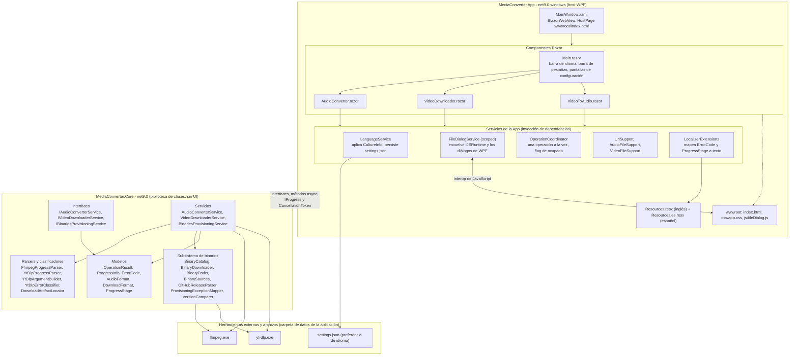
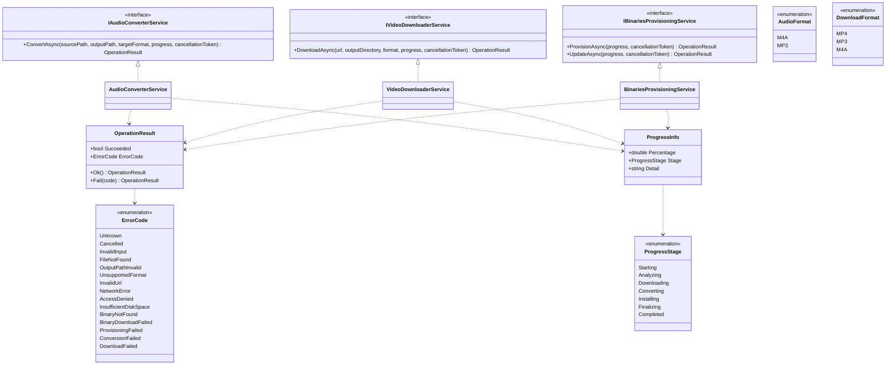

# Arquitectura

**[English](architecture.md) | [Español](architecture.es.md)**

Vista por capas de la solución. La dirección de la dependencia es estrictamente en un solo sentido:
la App depende de Core, y Core no depende de nada (sin WPF, sin Blazor, sin tipos de UI).

La regla de oro: Core nunca sabe que existe una UI. Expone interfaces, métodos async, progreso a
través de `IProgress<ProgressInfo>` y cancelación a través de `CancellationToken`, y reporta fallas
como valores `ErrorCode` legibles por máquina. La App traduce esos códigos al idioma activo, así
Core se mantiene libre de textos orientados al usuario.

## Componentes de Core

Vista de clases de MediaConverter.Core. Core no referencia tipos de WPF ni de Blazor, por lo que
puede probarse de forma aislada y reutilizarse desde cualquier host.

### Tipos auxiliares

- Pipeline de audio: `FfmpegProgressParser` interpreta la salida de ffmpeg `-progress pipe:1` como
  un porcentaje.
- Pipeline de descarga: `YtDlpArgumentBuilder` construye los argumentos de yt-dlp,
  `YtDlpProgressParser` interpreta sus líneas de progreso, `YtDlpErrorClassifier` mapea el stderr a
  un `ErrorCode`, y `DownloadArtifactLocator` encuentra el único archivo que produjo yt-dlp.
- Subsistema de binarios: `BinaryCatalog` y `BinaryDefinition` describen qué descargar,
  `BinaryDownloader` realiza el trabajo HTTP, `BinarySources` y `GitHubReleaseParser` resuelven las
  versiones, `BinaryPaths` resuelve dónde viven los binarios, `ProvisioningExceptionMapper` mapea
  excepciones a `ErrorCode`, y `VersionComparer` decide cuándo hace falta una actualización.
