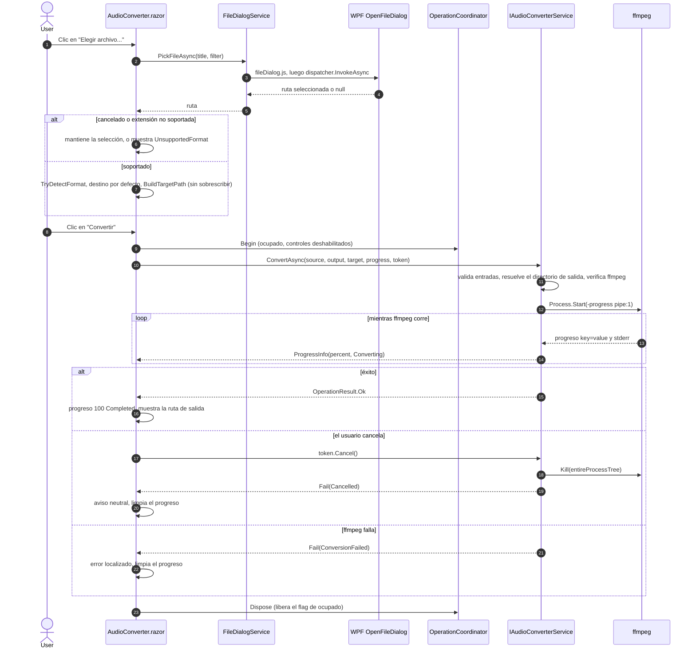
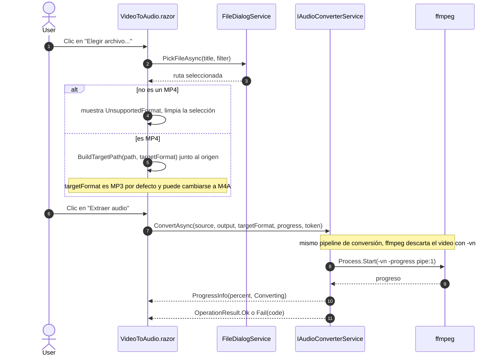

# Conversión de audio

**[English](audio-conversion.md) | [Español](audio-conversion.es.md)**

Secuencia de la pestaña de Audio, desde elegir un archivo hasta terminar una conversión de M4A a MP3
(o de MP3 a M4A).

## Video a audio

La pestaña Video a audio reutiliza exactamente el mismo pipeline de `IAudioConverterService`: ffmpeg
descarta el flujo de video con `-vn`, por lo que un origen MP4 sigue el mismo camino de código que un
archivo de audio; solo cambian el selector de archivo y el destino por defecto.

