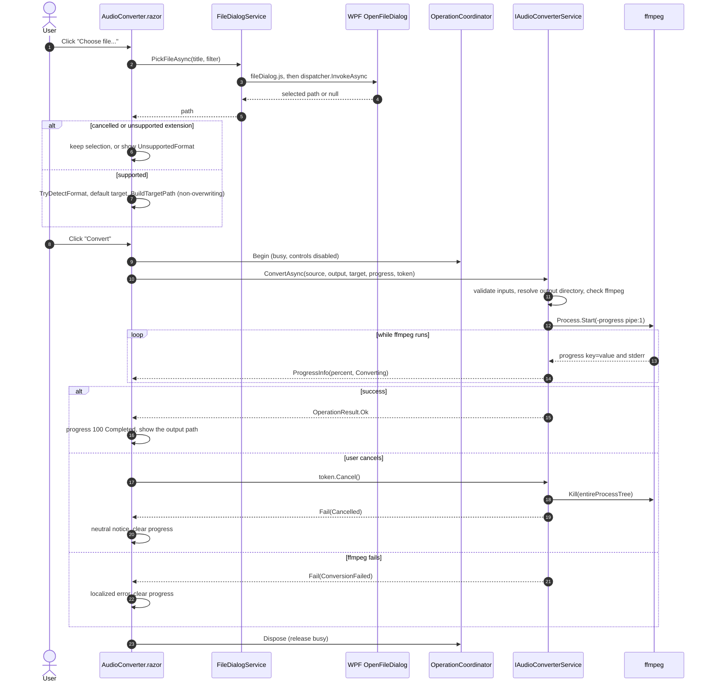
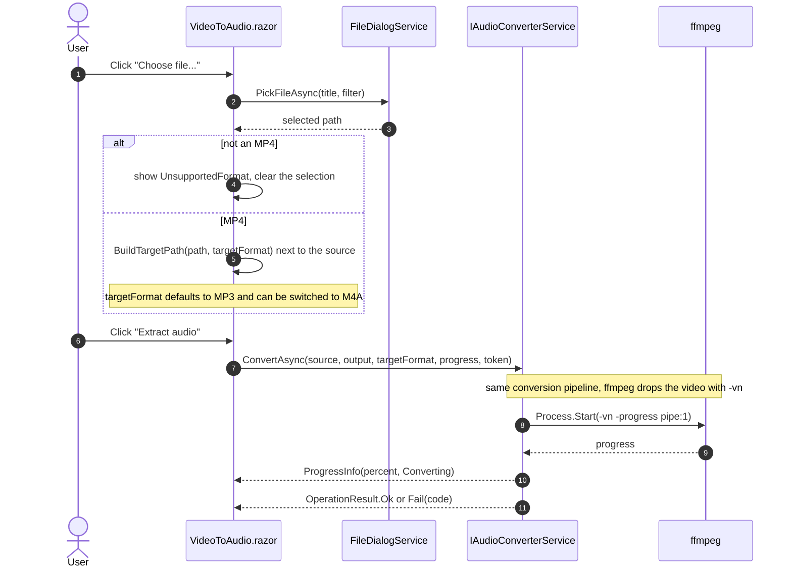

# Audio conversion

**[English](audio-conversion.md) | [Español](audio-conversion.es.md)**

Sequence for the Audio tab, from picking a file to a finished M4A to MP3 (or MP3 to M4A) conversion.

## Video to audio

The Video to audio tab reuses the exact same `IAudioConverterService` pipeline: ffmpeg discards the
video stream with `-vn`, so an MP4 source follows the identical code path as an audio file, only the
picker and the default target differ.

