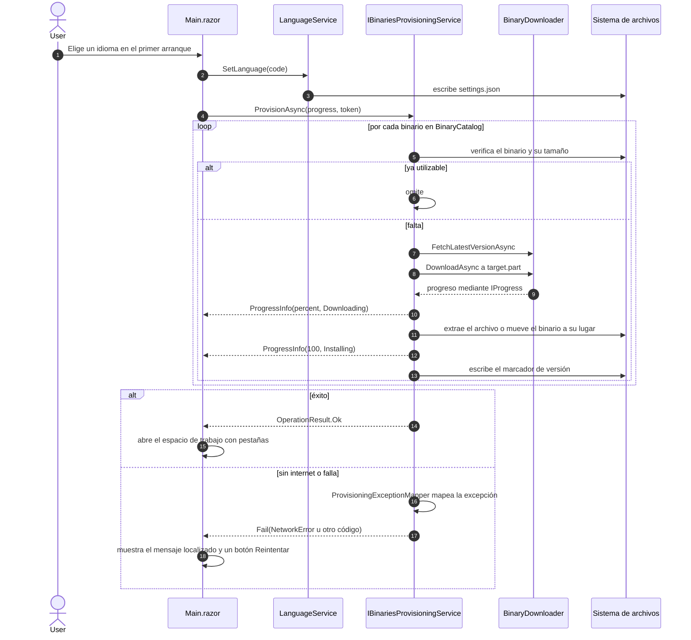

# Aprovisionamiento de binarios

**[English](binaries-provisioning.md) | [Español](binaries-provisioning.es.md)**

Flujo del primer arranque que prepara ffmpeg y yt-dlp en la carpeta de datos de la aplicación
(`%LOCALAPPDATA%\MediaConverter`). El progreso es real (basado en bytes), y una falla se mapea a un
código legible por máquina que la App localiza.

En corridas posteriores el idioma se lee de `settings.json` y el aprovisionamiento arranca de
inmediato; si los binarios ya están presentes y son válidos, se omiten.
