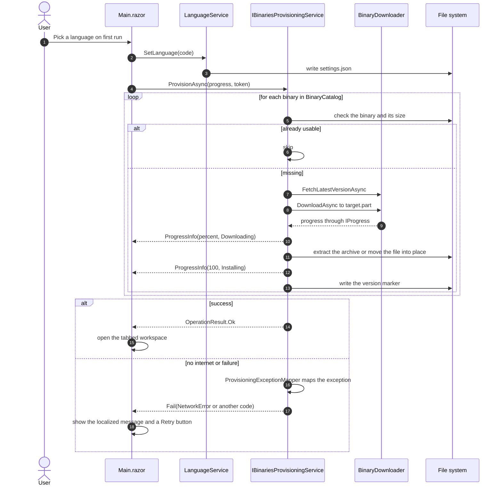

# Binaries provisioning

**[English](binaries-provisioning.md) | [Español](binaries-provisioning.es.md)**

First-run flow that prepares ffmpeg and yt-dlp in the application data folder
(`%LOCALAPPDATA%\MediaConverter`). Progress is real (byte-based), and a failure is mapped to a
machine-readable code that the App localizes.

On later runs the language is read from `settings.json` and provisioning starts immediately; if the
binaries are already present and valid they are skipped.
