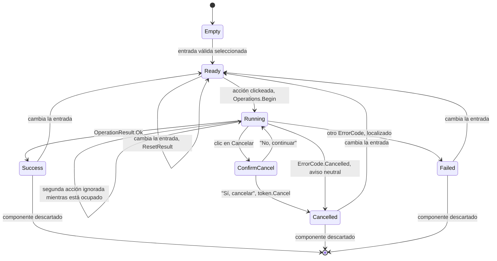

# Estados de operación de la UI

**[English](ui-operation-states.md) | [Español](ui-operation-states.es.md)**

Ciclo de vida compartido por las tres pestañas. `OperationCoordinator` reserva el turno de operación
antes del primer `await`, así el estado Running ignora un segundo clic y nunca corren dos
operaciones a la vez.

Notas:

- Los estados visuales de éxito, cancelación y error son consistentes en las tres pestañas, y una
  falla siempre limpia la barra de progreso.
- La acción permanece deshabilitada hasta que la entrada es válida: un archivo de origen y un
  formato de destino distinto para las pestañas de audio y de extracción, y una URL bien formada más
  una carpeta de destino para la pestaña de descarga.
- La confirmación de cancelación en línea desaparece sola si la operación termina primero.
