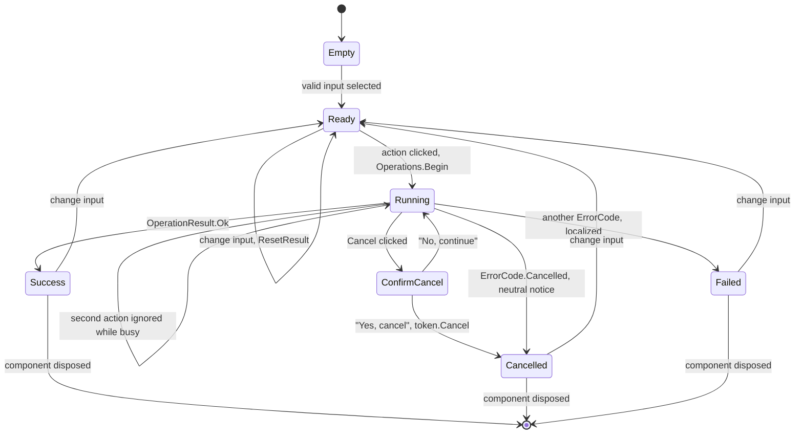

# UI operation states

**[English](ui-operation-states.md) | [Español](ui-operation-states.es.md)**

Lifecycle shared by the three tabs. `OperationCoordinator` reserves the operation slot before the
first `await`, so the Running state ignores a second click and no two operations ever run at once.

Notes:

- Success, cancellation and error visuals are consistent across the three tabs, and a failure always
  clears the progress bar.
- The action stays disabled until the input is valid: a source file and a different target format
  for the audio and extract tabs, and a well-formed URL plus a destination folder for the download
  tab.
- The inline cancel confirmation disappears on its own if the operation finishes first.
