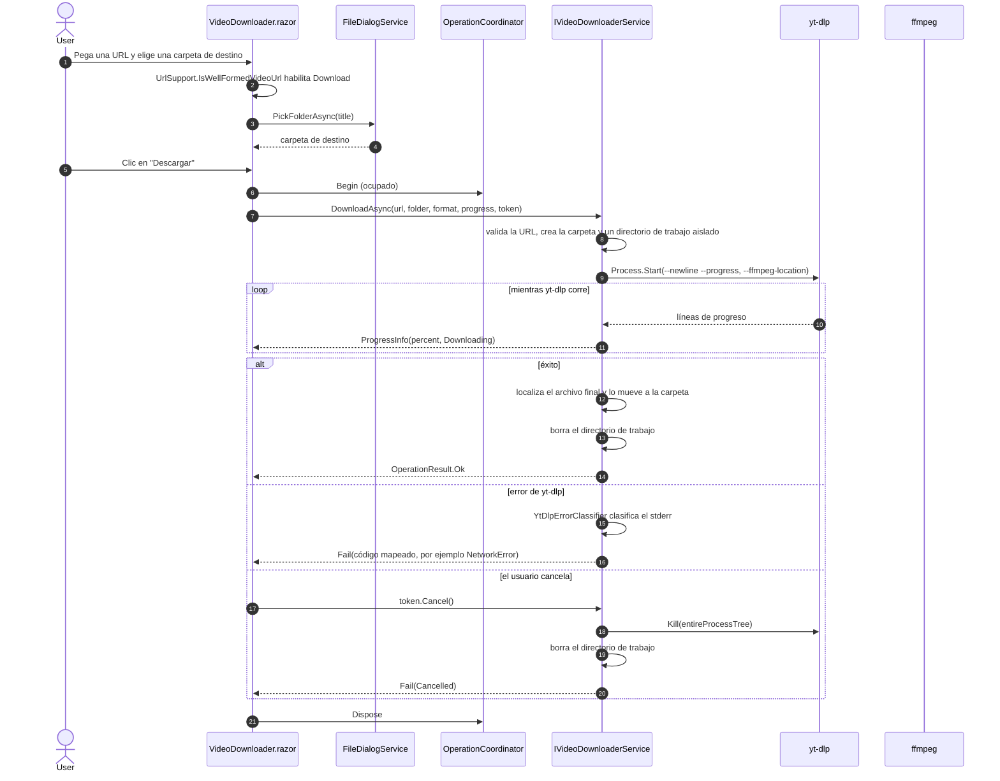

# Descarga de video

**[English](video-download.md) | [Español](video-download.es.md)**

Secuencia de la pestaña de Video, desde ingresar una URL hasta terminar una descarga. yt-dlp trabaja
dentro de un directorio aislado para que una corrida cancelada nunca deje archivos parciales en la
carpeta del usuario.

El `DownloadFormat` solicitado (MP4, MP3 o M4A) se pasa a yt-dlp a través de `YtDlpArgumentBuilder`,
que elige el mejor stream y delega la extracción o el muxing a ffmpeg.
