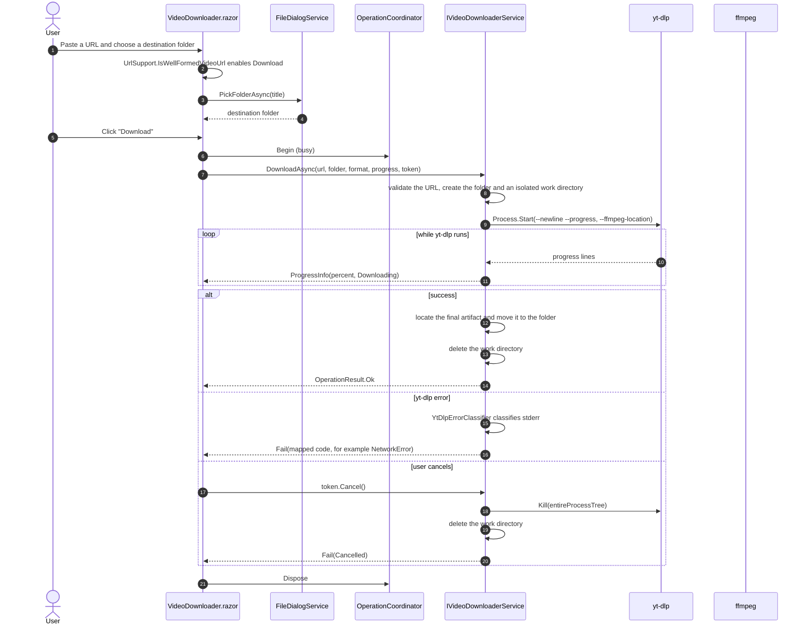

# Video download

**[English](video-download.md) | [Español](video-download.es.md)**

Sequence for the Video tab, from entering a URL to a finished download. yt-dlp works inside an
isolated directory so a cancelled run never leaks partial files into the user folder.

The requested `DownloadFormat` (MP4, MP3 or M4A) is passed to yt-dlp through `YtDlpArgumentBuilder`,
which selects the best stream and delegates the extraction or muxing to ffmpeg.
